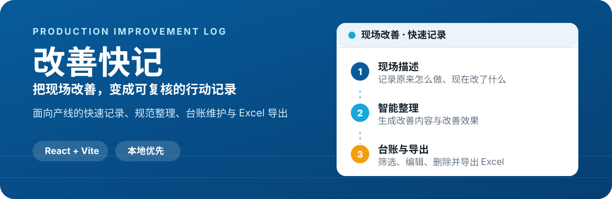

# 改善快记（Kaizen Quick Log）

<p align="center">
  
</p>

> 为生产现场而做的改善记录工具：在手机上快速留存问题与方案，在电脑上统一复核、维护并导出。

## 一次改善，从记录到台账

1. **现场记录**：选择产线与改善类型，写下原来的做法、当前方案和补充说明。
2. **整理表述**：使用本地规则引擎，或按需接入 AI 服务，生成可编辑的改善内容与效果。
3. **留存复核**：补充改善前后照片，保存至本机台账；在宽屏端筛选、编辑、删除或导出 Excel。

## 适合什么场景

- 生产现场随手记录线体、布局、MCP、POU、品质等改善事项
- 将零散的口头描述整理为可复核的改善内容和效果
- 按线体或筛选结果输出带照片的 Excel 改善清单
- 在同一浏览器中维护本地改善台账，无需先搭建后端

## 核心体验

- **手机优先的录入页**：真实手机浏览器直接使用全屏页面和原生纵向滚动。
- **持续可见的保存操作**：保存栏独立于表单滚动区域，填写长内容时仍可直接保存。
- **可维护的记录**：每条已保存记录都支持编辑更新与确认删除，避免重复或误删。
- **照片与数据一起归档**：改善前后照片可随记录导出到 Excel。
- **本地优先**：草稿和记录保存于浏览器 LocalStorage；未配置接口时，智能整理也无需联网。

## 功能范围

| 模块 | 能力 |
| --- | --- |
| 现场录入 | A/B/C/D/E/H 线、部装线、底座线；改善类型自动匹配或手动选择 |
| 内容整理 | 将原始描述转为改善内容和改善效果，结果仍可人工编辑 |
| 照片佐证 | 上传或拍摄改善前、改善后照片 |
| 台账管理 | 搜索、按线体/类型筛选、编辑、删除 |
| 导出 | 生成包含改善内容、效果、照片和备注的 Excel 清单 |

## 快速开始

需要 Node.js 环境。

```bash
npm install
npm run dev
```

开发服务器启动前会自动执行移动端运行时完整性检查。访问终端显示的本地地址后，可在手机尺寸浏览器或宽屏浏览器中体验对应界面。

## 可选：接入 AI 整理服务

默认情况下，应用使用内置规则引擎。若需要连接自己的服务，在项目根目录创建不提交的 `.env.local`：

```dotenv
VITE_AI_ENDPOINT=https://your-api.example.com/optimize
```

接口接收：

```json
{ "raw": "现场原始描述", "type": "改善类型", "line": "线体" }
```

接口返回：

```json
{ "content": "规范的改善内容", "effect": "改善效果" }
```

## 数据与隐私

- 改善记录和草稿仅保存在当前浏览器的 LocalStorage。
- 清除站点数据会删除本地记录；删除单条记录同样不可恢复。
- Excel 文件由用户在本地导出，用于后续留档。
- 仓库只包含改善快记网站代码与文档，不包含任何线体改善表格或导出的 Excel 文件。

## 验证与构建

```bash
# 检查受保护的移动运行时
npm run check:runtime

# 浏览器交互测试
npm run test:runtime

# Sites 构建与 Worker 测试
npm run build
npm run test:sites

# Vercel 静态构建
npm run build:vercel
```

`dist/` 是构建产物，不纳入版本控制。项目已提供 Vercel 配置，部署时使用 `npm run build:vercel`。

## 技术栈

- React 19 + TypeScript + Vite
- ExcelJS（Excel 导出）
- Playwright（运行时交互测试）
